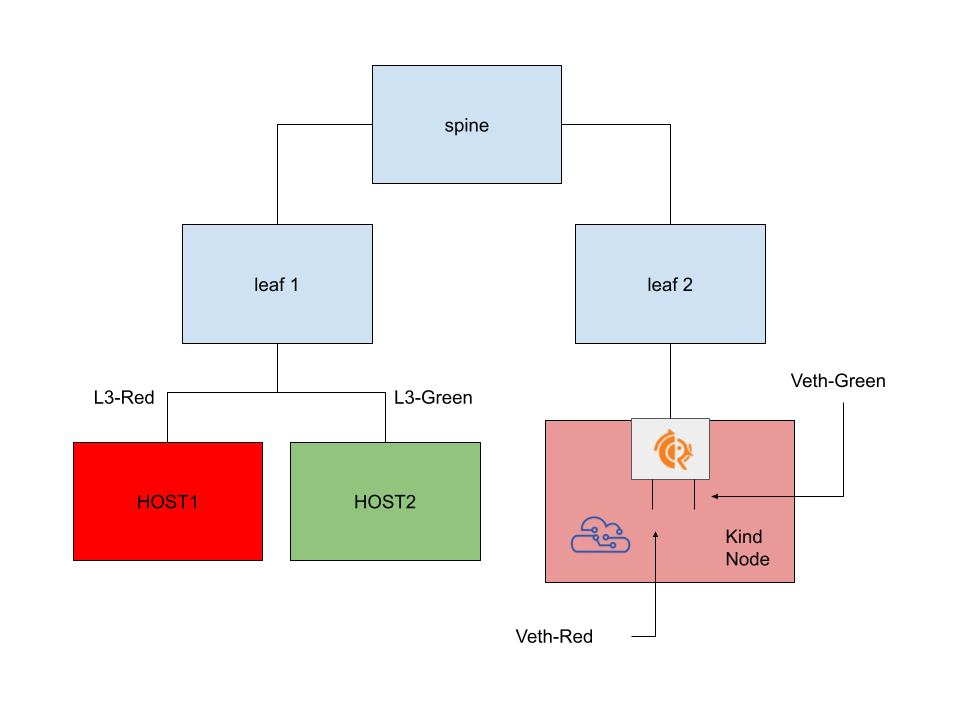
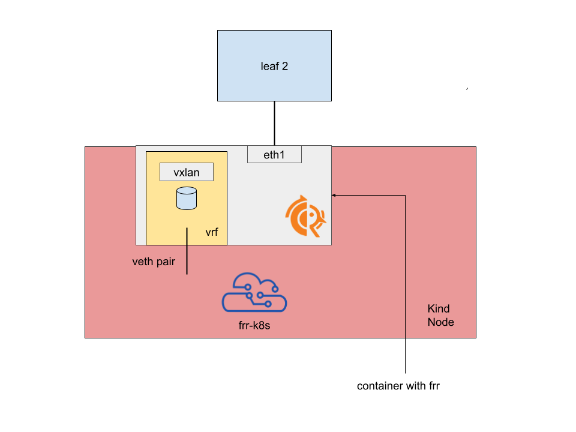

# Topology

This is the same topology as the [previous kind-l3 evpn lab](../04_from_kind) with the addition of multiple VRFs and
VXLan connecting two different hosts on `leaf1`.



Inside the Kind node we have a topology like the following:



but with two separate VRFs and two separate VXLan blocks.

## How to start

The lab leverages [containerlab](https://containerlab.dev/). The [clab file](./kind.clab.yaml) contains the definition
of the FRR containers, of the "host" container and the kind node, plus how they are connected together.

A convenience [setup.sh](./setup.sh) script is provided, to start the lab and execute the various setup commands inside the containers.

## The configuration

### Configuring the nodes

Each subfolder contains the frr configuration file related to the corresponding container, plus a setup.sh script used to assign IPs and
to create the VXLan and what FRR needs to make EVPN work.

For example, in the [leaf1 setup configuration file](./leaf1/setup.sh) we:

- assign the VTEP IP address to the loopback interface
- Assign IPs to both the veth connecting the leaf to the spine and the one connecting the "HOST" to the leaf
- Create a linux VRF corresponding to the L3 VRF and enslave the veth leg connected to the "HOST"
- Create all the machinery to make the EVPN / VXLan tunnel work, including a linux bridge and a VXLan interface

### Configuring Kind

The [kind](./kind) subfolder contains the configuration scripts for:

- Setting up the kind node via the [setup.sh](./kind/setup.sh) file
- Setting up the FRR container running in the node under [kind/frr](.kind/frr)
- Setting up FRR-K8s under [kind/frr-k8s](./kind/frr-k8s/)

## Validating

```bash
docker exec -it clab-kind-HOST1 ping 10.244.0.6
PING 10.244.0.6 (10.244.0.6) 56(84) bytes of data.
64 bytes from 10.244.0.6: icmp_seq=1 ttl=61 time=0.148 ms
64 bytes from 10.244.0.6: icmp_seq=2 ttl=61 time=0.090 ms
^C
--- 10.244.0.6 ping statistics ---
2 packets transmitted, 2 received, 0% packet loss, time 1052ms
rtt min/avg/max/mdev = 0.090/0.119/0.148/0.029 ms
```

Checking on leaf2 we see that both the request and the reply are encapsulated, which makes sense as
the tunneling happens locally to the node.

```bash
sudo ip netns exec clab-kind-leaf2 tcpdump -nn -i any
tcpdump: data link type LINUX_SLL2
dropped privs to tcpdump
tcpdump: verbose output suppressed, use -v[v]... for full protocol decode
listening on any, link-type LINUX_SLL2 (Linux cooked v2), snapshot length 262144 bytes
17:24:55.850570 eth1  In  IP 100.64.0.1.52099 > 100.65.0.2.4789: VXLAN, flags [I] (0x08), vni 100
IP 192.168.10.1 > 10.244.0.6: ICMP echo request, id 4, seq 1, length 64
17:24:55.850576 eth2  Out IP 100.64.0.1.52099 > 100.65.0.2.4789: VXLAN, flags [I] (0x08), vni 100
IP 192.168.10.1 > 10.244.0.6: ICMP echo request, id 4, seq 1, length 64
```
