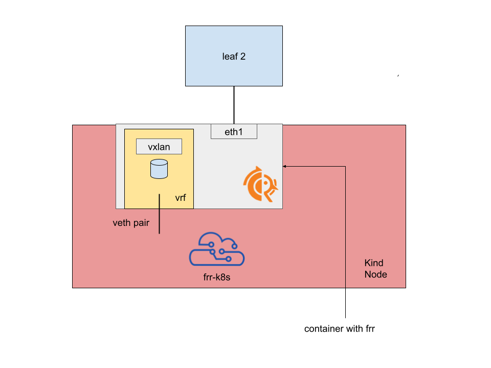

# Topology

This lab is basically the same as the [04_from_kind](../04_from_kind) one, with a spine - leaves topology with a host connected on one leaf,
and the node of a kind cluster connected to the other leaf via a L3 connection.


The main difference here is that we go from the host layout we had:



to a pod based one, where:

- the FRR container runs in a namespaced pod
- an external "controller" pod, which is hostnetwork-namespaced and has a way to access both the containerd socket and
to the namespaces sysfs is in charge of moving the eth1 interface inside the FRR pod and of creating the additional veths
to link the frr pod to the default namespace.


## How to start

The lab leverages [containerlab](https://containerlab.dev/). The [clab file](./kind.clab.yaml) contains the definition
of the FRR containers, of the "host" container and the kind node, plus how they are connected together.

A convenience [setup.sh](./setup.sh) script is provided, to start the lab and execute the various setup commands inside the containers.

## The configuration

### Configuring the nodes

Each subfolder contains the frr configuration file related to the corresponding container, plus a setup.sh script used to assign IPs and
to create the VXLan and what FRR needs to make EVPN work.

For example, in the [leaf1 setup configuration file](./leaf1/setup.sh) we:

- assign the VTEP IP address to the loopback interface
- Assign IPs to both the veth connecting the leaf to the spine and the one connecting the "HOST" to the leaf
- Create a linux VRF corresponding to the L3 VRF and enslave the veth leg connected to the "HOST"
- Create all the machinery to make the EVPN / VXLan tunnel work, including a linux bridge and a VXLan interface

### Configuring Kind

The [kind](./kind) subfolder contains the configuration scripts for:

- Setting up the kind node via the [setup.sh](./kind/setup.sh) file
- Setting up FRR-K8s under [kind/frr-k8s](./kind/frr-k8s/)

### The new pods

The way the pods (both the controller and the new frr one) configure themselves is quite rough, but sufficient to demonstrate
it's possible to run this setup under pods.

The two pods definitions can be found under [./frrpods](./frrpods), each with its own Dockerfile and a setup.sh file 
that is used to perform the tasks.

## Validating

```bash
docker exec -it clab-kind-HOST1 ping 10.244.0.6
PING 10.244.0.6 (10.244.0.6) 56(84) bytes of data.
64 bytes from 10.244.0.6: icmp_seq=1 ttl=61 time=0.148 ms
64 bytes from 10.244.0.6: icmp_seq=2 ttl=61 time=0.090 ms
^C
--- 10.244.0.6 ping statistics ---
2 packets transmitted, 2 received, 0% packet loss, time 1052ms
rtt min/avg/max/mdev = 0.090/0.119/0.148/0.029 ms
```

Checking on leaf2 we see that both the request and the reply are encapsulated, which makes sense as
the tunneling happens locally to the node.

```bash
sudo ip netns exec clab-kind-leaf2 tcpdump -nn -i any
tcpdump: data link type LINUX_SLL2
dropped privs to tcpdump
tcpdump: verbose output suppressed, use -v[v]... for full protocol decode
listening on any, link-type LINUX_SLL2 (Linux cooked v2), snapshot length 262144 bytes
17:24:55.850570 eth1  In  IP 100.64.0.1.52099 > 100.65.0.2.4789: VXLAN, flags [I] (0x08), vni 100
IP 192.168.10.1 > 10.244.0.6: ICMP echo request, id 4, seq 1, length 64
17:24:55.850576 eth2  Out IP 100.64.0.1.52099 > 100.65.0.2.4789: VXLAN, flags [I] (0x08), vni 100
IP 192.168.10.1 > 10.244.0.6: ICMP echo request, id 4, seq 1, length 64
```
